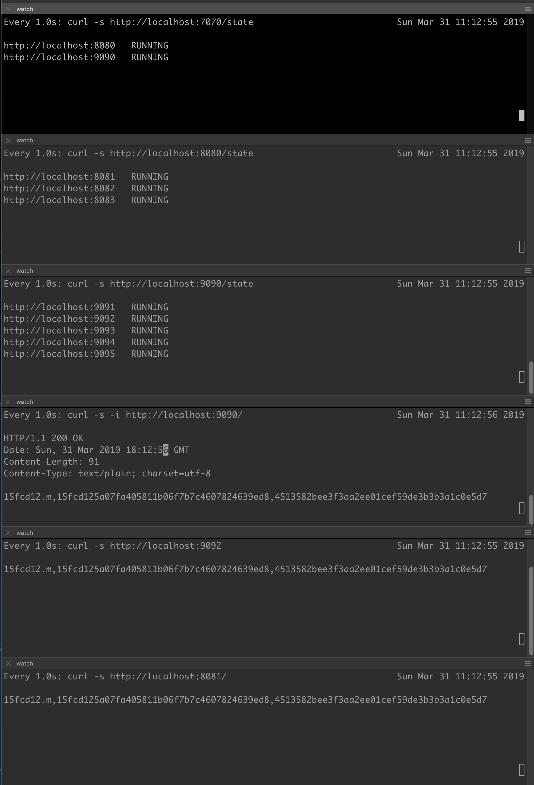

# Examples

## `Simple` server
This example implements a http server that can track a number of services.  In order to track the state of resources, the server creates a fsm (finite state machine) for each targeted resource it is meant to track.  The server then polls the resources periodically and will send signals via the `fsm` API.  The state machine specification can be found in `simple.go`.  The example here has a server running on localhost at `:7070` tracking other instances of the same simple server listening on `:8080` and `:9090`

  + If the services are not running, the `simple` server will start up it.
  + If the services are sending out error codes (e.g. 500, which you can force by calling HTTP GET at `/httpStatus?code=<error_code>`), then the simple server will kill it (via HTTP GET `/kill`) and then start it again.
  + You can get the list of resources each simple server manages via HTTP GET `/state`.


The services tracked by an instance of the `simple` server are specified in the `.conf` file.  The `.conf` file is a JSON map of target URL and a simple shell command on how to start it.  For example:

```
{
    "http://localhost:8080" : "build/simple simple-8080.conf :8080"
    ,
    "http://localhost:9090" : "build/simple simple-9090.conf :9090"
}

```

In this example, two resources are being tracked by the server if the server is given this conf file.  When tracking resources, the server will:

   + Periodically checks on the status of the resource by doing a HTTP GET at the target URL given.
   + If the service is not running, it will start it. For simplicity, this example implements simple forking a child process that will listen at the given port.  For example, for the target `http://localhost:8080`, we will start that resource/service via `os.Exec` with the command `build/simple simple-8080.conf :8080`.

### Building

```
cd example
make -k
```

### Running
```
cd example
build/simple - :9091                # starts server at :9091 and tracks nothing.
build/simple simple-7070.conf :7070 # starts at :7070 and tracks what's in conf file
```

### Scenario
This example shows a hierarchy of `simple` servers.  Starting at the top is the server running at `:7070`, configured by the file `simple-7070.conf`.  This server manages two target resources:

  + A `simple` service running at `:8080`, with configuration as in `simple-8080.conf`.  This service will manage another set of `simple` servers at various ports (see config file).
  + Another `simple` service running at `:9090`, with configuration as in `simple-9090.conf`, which describes a set of managed `simple` servers running at ports > 9090 (see config file).

Before starting up the top server at :7070, let's watch all the services and states.  In each terminal (or iTerm split terminal panes), do the following:

Window 1
```
watch -d -n 1 curl -s http://localhost:7070/state   # will show the state machines
```

Window 2
```
watch -d -n 1 curl -s http://localhost:8080/state   # will show the state machines
```

Window 3
```
watch -d -n 1 curl -s http://localhost:9090/state   # will show the state machines
```

Those 3 windows will show the state machines managed by the `simple` servers that have dependencies (children services).

In the following windows, show the HTTP GET status of some of the managed services:

Window 4
```
# This will show the status of the server.  Until all the managed services are up, it returns
# HTTP status of Service Unavailable, which is different than an Internal Server Error or 
# simply not responding to the connection request from a HTTP client.

watch -d -n 1 curl -s http://localhost:8080   
```

Window 5
```
# This will show the status of a managed service.  When it's ready 
# (there's a built-in startup delay), it will return 200.  Otherwise, the server refuses connection.

watch -d -n 1 curl -s http://localhost:9091
```

#### Expected Behavior:
Simply by starting the server at `:7070` will make sure all the dependent servers are started up as well.  You should see the state machines in servers that have dependent resources.  The states
are:
  + `UNKNOWN`: initial state where the status of service isn't known.
  + `PENDING`: if the target also manages other targets, then it will be in pending until all targets are running.
  + `RUNNING`: running state, where the ping of the service (e.g. in Window 4 and 5) returns 200.
  + `DOWN`: state when the target isn't running.
  + `ERROR`: state when the target returns an error code.  You can control this by doing a HTTP GET to `/httpStatus?code=500`, for example, to set all subsequent pings at `/` to return 500.
  + `PROVISIONING` : state when the service / target is coming up.
  + `STOPPING` : state when the service / target is being shut down.  A shutdown signal is implemented simply via HTTP GET `/kill`.

Starting the :7070 will eventually start up the entire graph of servers:

```
build/simple simple-7070.conf :7070
```

Here's an example of the watch sessions:




  